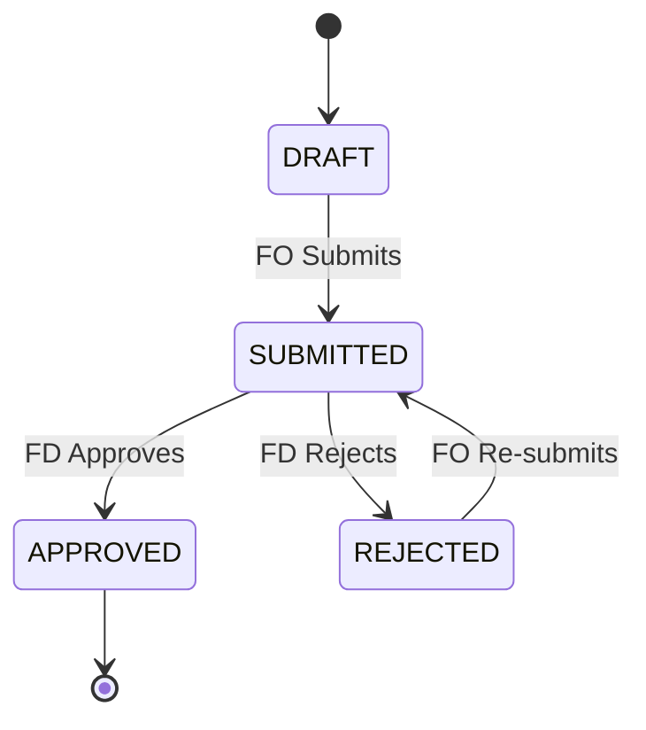

# 🔄 Workflows & Processes

## Overview

The core function of the platform is the monthly financial reporting cycle, where **Finance Officers** submit data for their respective companies, and **Finance Directors** review and approve it.

## 👥 Actors & Roles

| Role                  | Abbr.     | Responsibilities                                                 |
| :-------------------- | :-------- | :--------------------------------------------------------------- |
| **Finance Officer**   | **FO**    | Data entry, Variance analysis, Submission.                       |
| **Finance Director**  | **FD**    | Review, Approval, Rejection, Group-level analysis.               |
| **Managing Director** | **MD**    | Read-only access to high-level dashboards and finalized reports. |
| **System Admin**      | **Admin** | User management, Company/Cluster configuration.                  |

## 📉 Monthly Reporting Workflow

### 1. Draft Stage

- **Actor**: Finance Officer (FO)
- **Action**: Enters financial data (Revenue, Expenses, etc.) for the current open period.
- **System State**: Report status is `DRAFT`.
- **Note**: Data is saved automatically. Variance against budget is calculated in real-time.

### 2. Submission

- **Actor**: Finance Officer (FO)
- **Action**: Clicks "Submit for Review".
- **Validation**: System checks for completeness and data integrity.
- **System State**:
  - Report status changes to `SUBMITTED`.
  - **Notification**: Email sent to the assigned Finance Director.
  - **Lock**: FO can no longer edit the report.

### 3. Review Cycle

- **Actor**: Finance Director (FD)
- **Action**: Reviews the submitted report, analyzing variances and comments.
- **Outcome A: Rejection**
  - FD clicks "Send Back for Correction" with a mandatory comment.
  - **System State**: Status reverts to `REJECTED`.
  - **Notification**: Email sent to FO with the rejection reason.
  - FO can edit and re-submit.
- **Outcome B: Approval**
  - FD clicks "Approve".
  - **System State**: Status changes to `APPROVED`.
  - **Notification**: Email sent to FO confirming approval.
  - Report is now part of the confirmed Group Financials.

### 4. Group Analysis

- **Actor**: MD / FD
- **Action**: View consolidated dashboards.
- **Data Source**: Aggregates only `APPROVED` reports (or submitted ones depending on filter settings).

## 📊 State Machine

## 🔔 Notifications

| Event                | Recipient        | Channel        | Content                          |
| :------------------- | :--------------- | :------------- | :------------------------------- |
| **Report Submitted** | Finance Director | Email + In-App | Link to review page.             |
| **Report Approved**  | Finance Officer  | Email + In-App | Confirmation of completion.      |
| **Report Rejected**  | Finance Officer  | Email + In-App | Rejection reason & link to edit. |
